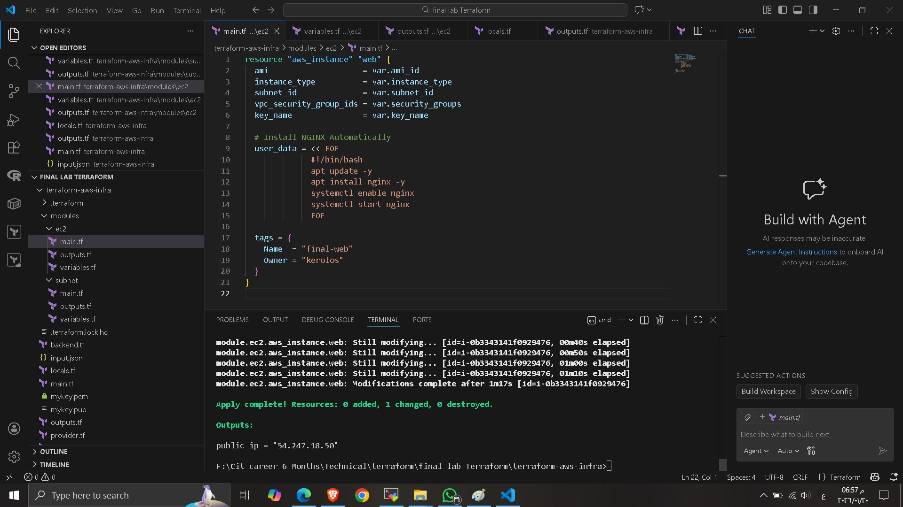
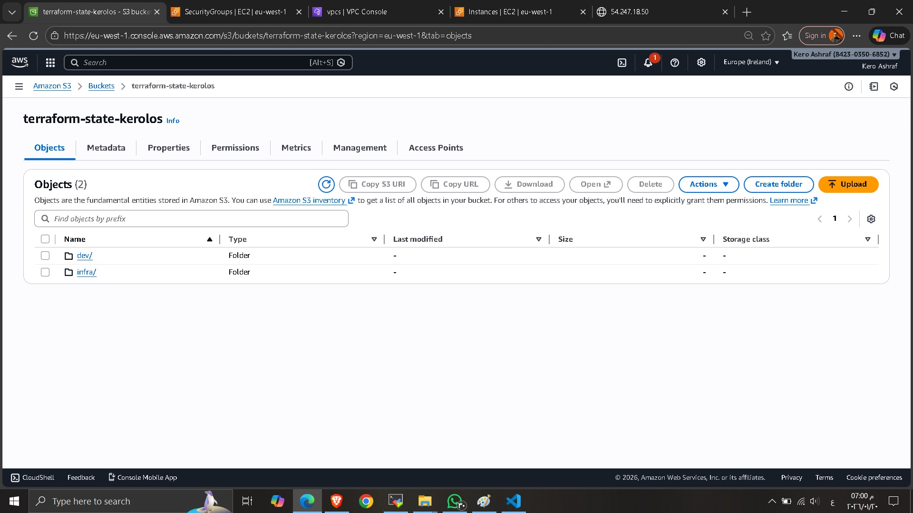
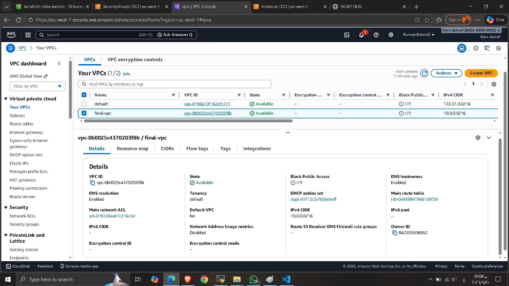
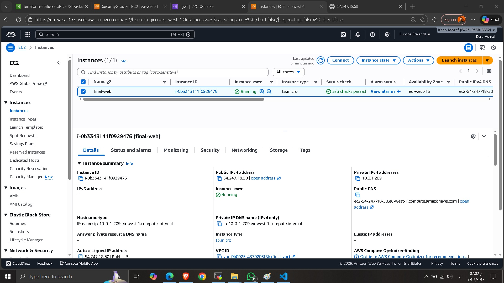
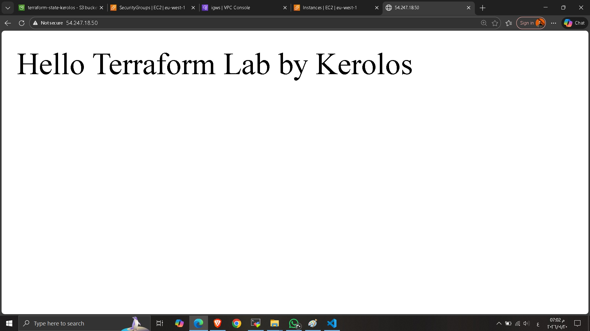

## 🚀 Terraform AWS Infrastructure – Final Lab

This project provisions a complete AWS infrastructure using **Terraform**, including VPC import, subnet creation, security group setup, EC2 deployment, and automated NGINX installation using user data.

---

## 📌 **Project Overview**

The Terraform configuration performs the following:

* Import and use an **existing VPC**
* Create a **Public Subnet**
* Create a **Security Group** allowing:

  * HTTP (80)
  * HTTPS (443)
  * SSH (22)
* Launch **Ubuntu 24.04 Free Tier EC2 instance**
* Install **NGINX automatically** using a user-data script
* Output the **EC2 Public IP**
* Upload screenshots in the `/screenshots/` folder

---

## 📁 **Project Structure**

```
terraform-aws-infra/
│   main.tf
│   variables.tf
│   outputs.tf
│   provider.tf
│   backend.tf
│   input.json
│   README.md
│   .gitignore
│
├── modules/
│   ├── ec2/
│   │   ├── main.tf
│   │   ├── variables.tf
│   │   └── outputs.tf
│   │
│   └── subnet/
│       ├── main.tf
│       ├── variables.tf
│       └── outputs.tf
│
└── screenshots/
    ├── vpc.png
    ├── ec2.png
    └── nginx.png
```

---

## 📸 **Screenshots**














---

##  **Author**

**Kerolos Ashraf**

---

## 👨‍🏫 Instructor  
**Eng. Omar Higgy**
